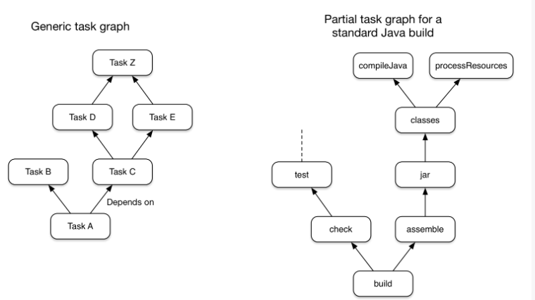

[TOC]


# Gradle简介

Gradle是专注于灵活性和性能的开源构建自动化工具

Gradle构建脚本是使用[Groovy](http://groovy-lang.org/)或[Kotlin](https://kotlinlang.org/) DSL 编写的

Gradle将其构建模型建模为任务（工作单元）的有向无环图（DAG）

此图显示了两个示例任务图，一个是抽象图，另一个是具体图，其中任务之间的依赖性表示为箭头：



几乎所有构建过程都可以建模为任务图，这就是Gradle如此灵活的原因之一。任务图既可以由插件定义，也可以由您自己的构建脚本定义

任务本身包括：

- 动作-做某事的工作，例如复制文件或编译源代码
- 输入-操作使用或对其进行操作的值，文件和目录
- 输出-操作修改或生成的文件和目录

Gradle任务等效于Ant目标

# 基本概念

Gradle构建（Gradle build）：

脚本：

Gradle包装器（Gradle wrapper）：

构建扫描：

命令行：

IDE：

存储库：

依赖项：

# gradle前提条件


Gradle在JVM上运行，并且必须安装Java开发工具包（JDK）才能使用它，可以在构建逻辑中使用标准Java API

配置jdk

Gradle附带了自己的Groovy库，因此不需要安装Groovy。Gradle将忽略任何现有的Groovy安装。

Gradle使用在路径中找到的任何JDK。或者，您可以将`JAVA_HOME`环境变量设置为指向所需JDK的安装目录。


配置bash

# 安装Gradle

下载gradle6.11

配置Gradle系统环境，指向bin目录

以下环境变量可用于该`gradle`命令。请注意，命令行选项和系统属性优先于环境变量。

- `GRADLE_OPTS`

  指定启动Gradle客户端VM时要使用的JVM参数。客户端VM仅处理命令行输入/输出，因此很少需要更改其VM选项。实际的构建由Gradle守护程序运行，不受此环境变量的影响。

- `GRADLE_USER_HOME`

  指定Gradle用户的主目录（`$USER_HOME/.gradle`如果未设置，则默认为）。

- `JAVA_HOME`

  指定要用于客户端VM的JDK安装目录。该VM也用于守护程序，除非在Gradle属性文件中使用指定了另一个VM `org.gradle.java.home`。

gradle -v	显示gradle版本 

# 配置Gradle构建环境

```
org.gradle.caching=(true,false)
```

当设置为true时，Gradle将在可能的情况下重用任何先前构建的任务输出，从而使构建速度更快。了解有关[使用构建缓存的](https://docs.gradle.org/current/userguide/build_cache.html#build_cache)更多信息。

```
org.gradle.caching.debug=(true,false)
```

设置为true时，单个输入属性哈希值和每个任务的构建缓存键都记录在控制台上。了解有关[任务输出缓存的](https://docs.gradle.org/current/userguide/build_cache.html#sec:task_output_caching)更多信息。

```
org.gradle.configureondemand=(true,false)
```

启用[按需](https://docs.gradle.org/current/userguide/multi_project_builds.html#sec:configuration_on_demand)孵化[配置](https://docs.gradle.org/current/userguide/multi_project_builds.html#sec:configuration_on_demand)，Gradle将尝试仅配置必要的项目。

```
org.gradle.console=(auto,plain,rich,verbose)
```

自定义控制台输出的颜色或详细程度。默认值取决于Gradle的调用方式。有关其他详细信息，请参见[命令行日志记录](https://docs.gradle.org/current/userguide/command_line_interface.html#sec:command_line_logging)。

```
org.gradle.daemon=(true,false)
```

当设置`true`的[摇篮守护进程](https://docs.gradle.org/current/userguide/gradle_daemon.html#gradle_daemon)来运行构建。默认值为`true`。

```
org.gradle.daemon.idletimeout=(# of idle millis)
```

指定的空闲毫秒数后，Gradle守护程序将自行终止。默认值为`10800000`（3小时）。

```
org.gradle.debug=(true,false)
```

设置`true`为时，Gradle将在启用远程调试的情况下运行构建，侦听端口5005。请注意，这等效于添加`-agentlib:jdwp=transport=dt_socket,server=y,suspend=y,address=5005`到JVM命令行，并且将挂起虚拟机，直到连接了调试器。默认值为`false`。

```
org.gradle.java.home=(path to JDK home)
```

指定用于Gradle构建过程的Java主页。可以将值设置为`jdk`或`jre`位置，但是，根据您的构建方式，使用JDK更安全。如果未指定设置，则从您的环境（`JAVA_HOME`或的路径`java`）派生合理的默认值。这不会影响用于启动Gradle客户端VM的Java版本（[请参阅环境变量](https://docs.gradle.org/current/userguide/build_environment.html#sec:gradle_environment_variables)）。

```
org.gradle.jvmargs=(JVM arguments)
```

指定用于Gradle守护程序的JVM参数。该设置对于[配置JVM内存设置](https://docs.gradle.org/current/userguide/build_environment.html#sec:configuring_jvm_memory)以提高构建性能特别有用。这不会影响Gradle客户端VM的JVM设置。

```
org.gradle.logging.level=(quiet,warn,lifecycle,info,debug)
```

当设置为安静，警告，生命周期，信息或调试时，Gradle将使用此日志级别。这些值不区分大小写。该`lifecycle`级别是默认级别。请参阅[选择日志级别](https://docs.gradle.org/current/userguide/logging.html#sec:choosing_a_log_level)。

```
org.gradle.parallel=(true,false)
```

配置后，Gradle将分叉到`org.gradle.workers.max`JVM以并行执行项目。要了解有关并行任务执行的更多信息，请参阅[Gradle性能指南](https://guides.gradle.org/performance/#parallel_execution)。

```
org.gradle.warning.mode=(all,fail,summary,none)
```

当设置为`all`，`summary`或者`none`，摇篮会使用不同的预警类型的显示器。有关详细信息，请参见[命令行日志记录选项](https://docs.gradle.org/current/userguide/command_line_interface.html#sec:command_line_logging)。

```
org.gradle.workers.max=(max # of worker processes)
```

配置后，Gradle将最多使用给定数量的工人。默认值为CPU处理器数。另请参阅[性能命令行选项](https://docs.gradle.org/current/userguide/command_line_interface.html#sec:command_line_performance)。

```
org.gradle.priority=(low,normal)
```

指定Gradle守护程序及其启动的所有进程的调度优先级。默认值为`normal`。另请参阅[性能命令行选项](https://docs.gradle.org/current/userguide/command_line_interface.html#sec:command_line_performance)。

# Gradle构建的基本元素

## 项目projects

## 任务tasks

## 文件API

# 构建生命周期Build Lifecycle

* 初始化

* 配置

* 执行


# 初始化项目

设置构建环境，并确定哪些项目将参与其中。

gradle init

```
$ gradle init

Select type of project to generate:
  1: basic
  2: application
  3: library
  4: Gradle plugin
Enter selection (default: basic) [1..4] 1

Select build script DSL:
  1: Groovy
  2: Kotlin
Enter selection (default: Groovy) [1..2] 1

Project name (default: ml): test

```

生成的文件

```groovy
├── build.gradle  用于配置当前项目的Gradle构建脚本
├─—─ gradle
│   └── wrapper
│       ├── gradle-wrapper.jar  Gradle Wrapper可执行JAR
│       └── gradle-wrapper.properties  Gradle Wrapper配置属性
├── gradlew  基于Unix的系统的Gradle Wrapper脚本
├── gradlew.bat  适用于Windows的Gradle Wrapper脚本
└── settings.gradle  用于配置Gradle构建的Gradle设置脚本
```

# 创建任务

一个项目包含多个任务，每个任务执行一些基本操作。


步骤1：创建名为src的目录

步骤2：在src目录中新建file.txt文件，文件内容为Hello，World。

步骤3：在build.gradle文件中，定义一个copy类型的任务，

```groovy
task copy(type: Copy, group: "Custom", description: "Copies sources to the dest directory") {
    from "src"
    into "dest"
}
```

```
gradle tasks --all
```

任务依赖

动态任务

# 构建扫描

```
gradle build --scan
```

# 自定义任务类型Custom task types

# 自定义任务动作Custom task actions

# 自定义协议Custom conventions

# 自定义模型A custom model

```groovy
task hello {
    doLast {
        println 'Hello world!'
    }
}
```

```
> gradle -q hello
Hello world!
```

What does `-q` do?

so that only the output of the tasks is shown